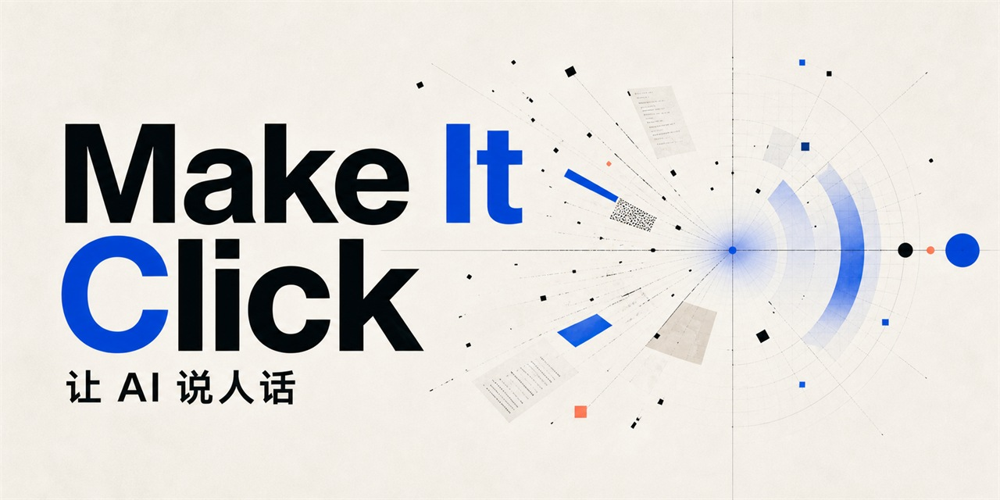

<p align="center">
  
</p>

<h1 align="center">Make It Click · 一点通</h1>

<p align="center">
  <strong>不把知识讲浅，而是换个角度，一点就通。</strong><br>
  为每个疑问选择最合适的解释方式，再把直觉带回准确、专业的表达。
</p>

<p align="center">
  <a href="skill/make-it-click/SKILL.md"></a>
  <a href="skill/make-it-click/SKILL.md"></a>
  &nbsp;
  <a href="adapters/claude-code/README.md"></a>
  <a href="adapters/claude-code/README.md"></a>
  &nbsp;
  <a href="adapters/deepseek/README.md"></a>
  <a href="adapters/deepseek/README.md"></a>
  <a href="LICENSE"></a>
  <a href="https://github.com/bydtesla1609/make-it-click/stargazers"></a>
  <a href="metrics/acquisitions.json"></a>
</p>

<p align="center">
  <a href="#-为什么需要它">为什么需要它</a>
  &nbsp;·&nbsp;
  <a href="#-它如何解释">它如何解释</a>
  &nbsp;·&nbsp;
  <a href="#-快速开始">快速开始</a>
  &nbsp;·&nbsp;
  <a href="#-公共表达库">公共表达库</a>
</p>

## ✏ 为什么需要它

AI 经常不是答错了，而是**答得正确，却让人看不懂**：术语换成另一批术语，例子和概念对不上，或者为了“简单”省掉了真正重要的条件。

Make It Click 是一个跨 AI 使用的解释型 Skill。它先判断用户究竟卡在哪里，再从白话、例子、类比、反例、几何视角、对比或逐步推演中，选择当下最合适的方式。

它不替换原答案，也不强迫 AI 套固定模板。证明、推导、算法逻辑、例外条件和专业术语都会保留；直观解释只是帮助用户走向严谨理解的桥。

## 🧭 它如何解释

1. **找到疑问**：只处理用户不理解的概念、关系或步骤，不把整段回答无差别简化。
2. **选择方法**：用户可以指定角度；未指定时，AI 根据问题性质选择最贴切的方式，而不是随机或机械套类比。
3. **守住准确性**：指定方式如果会误导，AI 会说明限制、修正视角或换一种解释。
4. **回到专业表达**：讲清直觉后，重新连接正式术语、定义、符号和必要条件。

准确性是硬边界。没有合适类比时，直接说白话或举一个具体例子，往往才是最好的解释。

## ⚡ 快速开始

Make It Click 只能显式调用，而且每次调用只影响当前回答。

如果只想获取核心 Skill，可以直接下载 [`make-it-click-skill.zip`](https://github.com/bydtesla1609/make-it-click/releases/latest/download/make-it-click-skill.zip)。解压后会得到完整的 `make-it-click` 文件夹，再按所用平台放到对应位置即可。

README 顶部的“累计下载”由仓库的完整 Clone 次数与正式 ZIP 的下载次数相加得到。它表示项目被主动获取的次数，不等同于实际安装人数或活跃用户数；[查看公开统计明细](metrics/acquisitions.json)。

###  Codex

将 [`skill/make-it-click`](skill/make-it-click) 复制到 Codex 的个人 Skill 目录：

```text
$CODEX_HOME/skills/make-it-click
```

重新加载 Skill 后显式调用：

```text
使用 $make-it-click，从空间立体几何的角度讲讲线性和非线性方程组。
```

###  Claude Code

Claude Code 支持读取 `SKILL.md`。将 [`skill/make-it-click`](skill/make-it-click) 复制到以下任一位置：

- 个人级：`~/.claude/skills/make-it-click/`
- 项目级：`.claude/skills/make-it-click/`

在 `/skills` 中将 `make-it-click` 设为 `user-only`，然后输入 `/make-it-click` 显式调用。具体说明见 [Claude Code 适配指南](adapters/claude-code/README.md)。

###  DeepSeek

DeepSeek API 没有相同的文件式 Skill 发现机制。使用 DeepSeek API 或支持 system prompt 的客户端时，将 [`SKILL.md`](skill/make-it-click/SKILL.md) 与 [`expression-library.md`](skill/make-it-click/references/expression-library.md) 的完整内容放入首条 `system` 消息，再把实际问题作为 `user` 消息发送。具体说明见 [DeepSeek 适配指南](adapters/deepseek/README.md)。

> 三个平台共用同一份核心 Skill。适配指南说明的是加载方式，不代表已经对所有客户端版本做过相同的实时效果测试。

其他 AI 或 Agent 可以参考 [通用适配说明](adapters/generic-agent/INSTRUCTIONS.md)。

## 📝 使用示例

```text
使用 $make-it-click，帮我讲清楚这道算法题为什么要用动态规划。
```

```text
使用 $make-it-click，SEO 和 GEO 分别是什么意思？它们有什么区别？
```

```text
使用 $make-it-click，你说这个页面“AI 味很重”，具体是哪些地方造成的？
```

## 🧰 公共表达库

[`expression-library.md`](skill/make-it-click/references/expression-library.md) 是项目唯一的公共表达库，收录两类内容：

- **表达方法**：具体怎么讲，例如完整类比、几何视角、反例和因果链；
- **表达框架**：面对不同性质的内容，怎样选择和组合表达方法。

如果用户或 AI 实际使用了库中没有的新方法或框架，AI 会先完成解释，再询问是否将它整理成公共贡献候选。更换措辞、数字或例题，不算创造了新方法。

没有仓库写入权限也可以贡献。候选由用户确认后提交，维护者审核并合并才会进入公共库。详见 [贡献说明](CONTRIBUTING.md)。

## 📖 行为验收

仓库使用 [`evals/cases.md`](evals/cases.md) 检查实际行为，而不是匹配固定措辞。验收重点包括：

- 是否选择了真正适合问题的解释方式；
- 是否保留必要的事实、证明、推理和专业术语；
- 是否拒绝会制造错误认识的类比；
- 是否区分新方法与普通例题变化；
- 是否遵守显式调用和单次回答边界。

## 📄 License

本项目采用 [MIT License](LICENSE) 开源。

<p align="center">
  <strong>换一种解释，让理解真正发生。</strong><br>
  如果这个项目对你有帮助，欢迎点一个 Star ⭐
</p>
